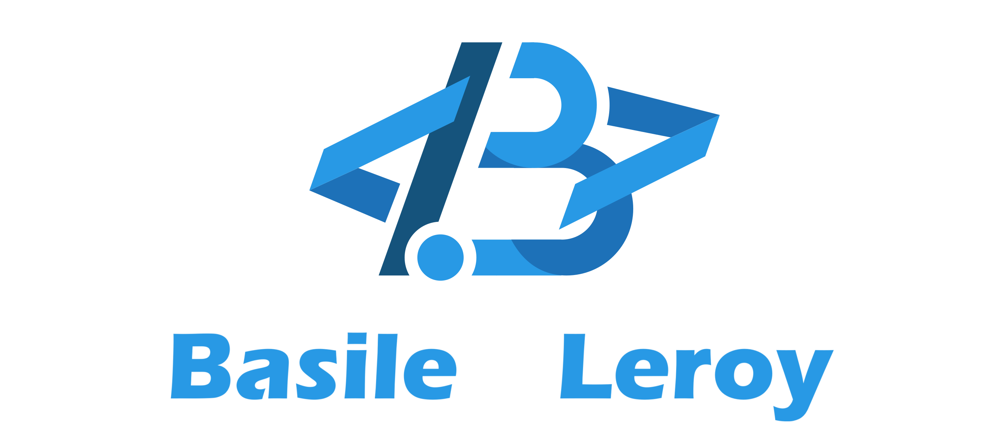
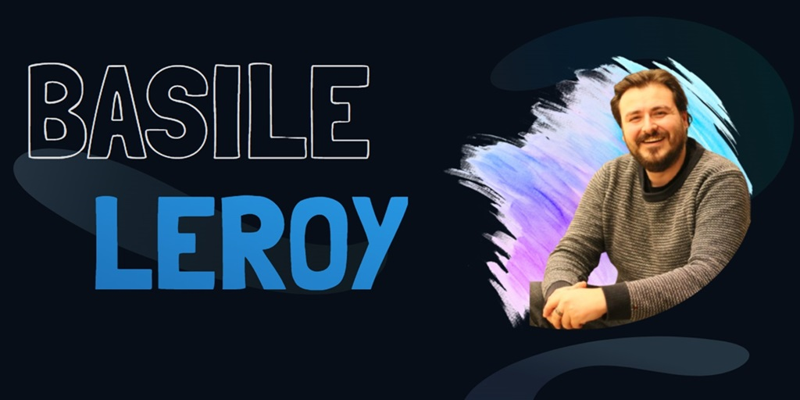
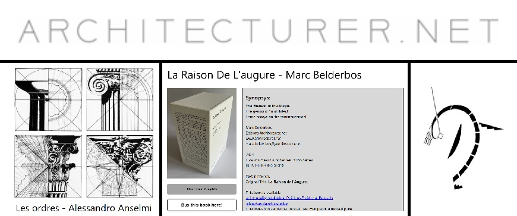
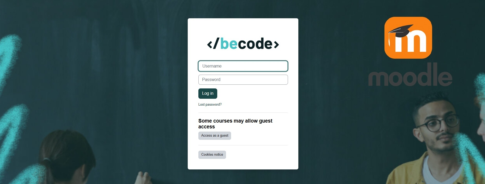

 
   
## About me:
A guy that found his passion in coding stuff. Combine this with: sociable, a learning enthousiast, curious, teamplayer, and many more..   
And maybe you will find I might be a good fit for your team!   
   
---  

# Portfolio 

 
> My portfolio and contact website. A static website about myself and the projects I worked on and also a way to contact me online  
> * About me  
> * My projects 
> * Contact me

# Architecturer.net

> A website For Mark Belderbos, an architect and honorary professor at the University of Leuven (Belgium) to share his thoughts, products and projects.
> * Personalised content management system 
> * Contact page  
> * Projects/books/thoughts display

# Moodle Learning Platform (Becode) 

> A learning platform for students at Becode (a training centre for IT related jobs). The platform is build with the Moodle Open Source modules and adapted with custom plugins and needs.
> * Content creation
> * Custom plugin for additional actions on creating new users
> * Customized Attendance plugin to update and maintain attendances of our learners

# Hustle Prime

> a Gamer Guide website made for the Hustle Castle game community.The project was eventually dropped before it could be finished, so here is a (not completely finished demo deployment instead).
> * Complex "bracket" calculations, where you can calculate which level combinations are best for your level
> * A dynamic Gear suggestion form, to see based on your avatar, which gear is most recommended
> * Game documentation and recommendations